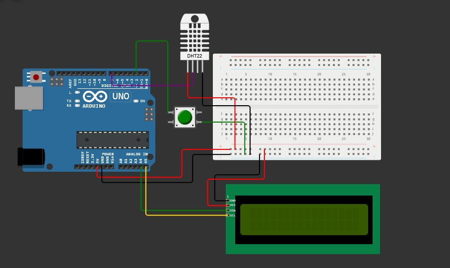

# Temperatur Sensor
This is a school project. And the purpose of project it self is to create a temperature sensor. The product would be used to measure air room temperature. The temperature sensor uses DHT11. And it is running on Arduino UNO R3.

# Circuit Design
The design for this project is created using [wokwi](https://wokwi.com/). Keep in mind, the DHT11 sensor is not available in tinkercad but there is a similiar sensor called DHT22 that you can use.

# Usage
Make sure you have already prepared all the components that will be used as in the [circuit design](#circuit-design). Then you need to connect all components accordingly.
1. Download [Arduino IDE](https://www.arduino.cc/en/software).
2. Download [NewLiquidCrystal library](https://github.com/fmalpartida/New-LiquidCrystal). Then add the library to Arduino IDE.
3. Upload the code to the arduino.

# Reference
- https://www.tinkercad.com/things/6fjM2wxdZus-button-counter
- https://www.tinkercad.com/things/dvwA3ydHQqA-lcd-escrita-lcd
-https://www.instructables.com/Temperature-Sensor-With-Arduino-UNO/
- https://legwinskij.blogspot.com/2011/09/lm335-arduino-temperature-sensor.html
- https://github.com/build2master/arduino-lcd-scroll-long-text/blob/master/arduino-lcd-scroll-long-text.ino
- https://maxpromer.github.io/LCD-Character-Creator/
- https://www.youtube.com/watch?v=GzFUNbXqS5g